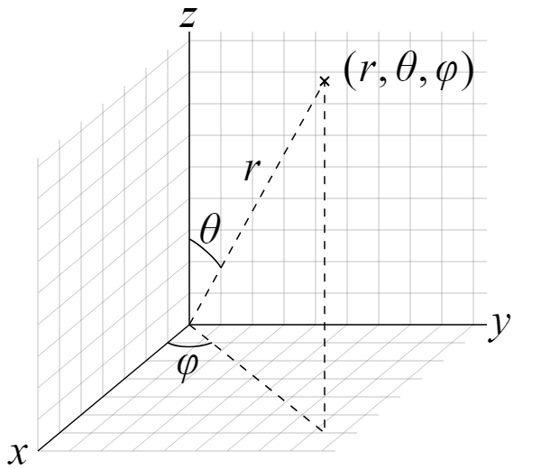

**coordinates system**

Geographic coordinates are traditionally expressed in the sexagesimal system, sometimes noted as "DMS": degrees (°), minutes (′), and seconds (″). 

The basic unit is the degree of angle (1 full circle = 360°), then the minute of angle (1° = 60′), and finally the second of angle (1° = 3,600″).

To provide an approximate comparison of these units in terms of distance on the Earth's surface, the circumference of the Earth, which corresponds to 360°, is exactly 40,007.864 km along a double meridian. It is precisely 40,075.017 km at the equator; therefore:

- One degree represents approximately 111.319 km (at the equator);
- One minute represents approximately 1.855 km (at the equator);
- One second represents approximately 30.92 m (at the equator).

Measurements smaller than a second are noted using the decimal system.

These distances, corresponding to a difference in longitude (in degrees, minutes, or seconds), vary according to the latitude of the location since the Earth's meridians gradually converge from the equator toward the poles. The table below provides some illustrative examples.

Lengths of Longitude Differences at Different Latitudes

| Latitude       | City             | One Degree ≈ | One Minute ≈ | One Second ≈ | ±0.0001° ≈ |
|----------------|------------------|--------------|--------------|--------------|------------|
| 60° 10′ 32″ N  | Helsinki         | 55.50 km     | 0.925 km     | 15.40 m      | 5.50 m     |
| 51° 28′ 38″ N  | Greenwich        | 69.47 km     | 1.158 km     | 19.30 m      | 6.95 m     |
| 44° 50′ 16″ N  | Bordeaux         | 78.85 km     | 1.31 km      | 21.90 m      | 7.89 m     |
| 29° 58′ 00" N  | New Orleans      | 96.49 km     | 1.61 km      | 26.80 m      | 9.65 m     |
| 0° 14′ 18″ S   | Quito            | 111.3 km     | 1.855 km     | 30.92 m      | 11.13 m    |

Latitude is the angle between the equatorial plane and the line extending from the center of the Earth to a certain point on its surface. It references the north-south position on the Earth. It's represented by circles of latitude, or parallels - the lines that go around the globe. The central line of latitude is called the Equator. It has a latitude of 0 degrees. The maximum value of latitude is 90 degrees - found at the poles.

Longitude, on the other hand, refers to an east-west position on the Earth. Lines of longitude, or meridians, connect the North and the South Pole. They extend to the east and west of the Prime Meridian, reaching up to 180 degrees. All meridians have the same length - 12,429.9 miles (20,003.93 km).

**How to write coordinates?**

The first rule of writing coordinates is:

**First comes the latitude, then the longitude.**

Sometimes to help distinguish between latitude and longitude, their respective symbols are included: φ (phi) for latitude and λ (lambda) for longitude. To formulate coordinates you can use:

- **DD** (decimal degrees - °)
- **DMS** (degrees - °, minutes - ', seconds - ")
- **DDM** (degrees (°), decimal minutes ('))

To specify the cardinal direction, you can use letters or positive and negative numbers. For latitude, northern directions may be indicated by the letter **N** or a positive number, and southern directions can be marked with either the letter **S** or a negative value. For longitude, you can use the letter **E** or a positive number for the eastern direction, and the western direction can be indicated by the letter **W**, or a negative number. **Remember - don't mix the forms!** If you're using letters, values should always be positive.

Expressing the direction with positive or negative values is common in the **DD** format of coordinates. It's less popular with **DMS** or **DDM**.

**The haversine formula or haversine distance**

Assume an arbitrary point located somewhere in a three-dimensional space. Let's call:

- **θ** (theta), the angle between the **z-axis** and the position vector (**r**); and
- **ϕ** (phi), the angle between the **x-axis** and the projection of the position vector on the **xy plane**.

These are called polar coordinates.

*Polar coordinates in a three-dimensional space.*



The haversine is a trigonometric function that is equal to half a versine. And what's a versine? It's 1 minus the cosine of an angle.

\[ \text{hav}(\theta) = \frac{1 - \cos(\theta)}{2} \]

```math
\[ \text{hav}(\theta) = \frac{1 - \cos(\theta)}{2} \]
```

**Obtaining the distance between two points on Earth – distance between coordinates**

If we apply the haversine formula for a central angle (i.e., the angle between two points along a great circle on a sphere with radius R) and solve for distance, we obtain:


```math
\[ d = 2R \times \sin^{-1} \left( \sqrt{ \sin^2 \left( \frac{θ₂ - θ₁}{2} \right) + \cos(θ₁) \times \cos(θ₂) \times \sin^2 \left( \frac{φ₂ - φ₁}{2} \right) } \right) \]
```

where:

- **θ₁, φ₁** – First point latitude and longitude coordinates;
- **θ₂, φ₂** – Second point latitude and longitude coordinates;
- **R** – Earth's radius (R = 6371 km); and
- **d** – Distance between them along Earth's surface.

Keep in mind that the angles **θ₁** and **θ₂** are not the same as those used in the spherical coordinate system introduced above. They denote latitude in this formula.

🙋 Having trouble finding central angles? Perhaps our central angle calculator can help you with that.

Using this haversine distance formula, you can translate latitude and longitude to distance, given the coordinates of two points on Earth, although with a minor setback. It can result in an error of up to 0.5% because the Earth is not a perfect sphere.

Of course, the faster way is to use our latitude longitude distance calculator, but it's good to know where things come from.

### Examples using the latitude longitude distance calculator

**Distance between Paris and Krakow**

Let's assume we want to find the distance between these two European cities. First, we need to find their coordinates:

- **Paris**: Lat: 48.8566° N, Long: 2.3522° E.
- **Krakow**: Lat: 50.0647° N, Long: 19.9450° E.

After typing the coordinates in the calculator, we obtain that the distance between Paris and Krakow is 1275.6 km or 792.6 miles. Keep in mind this is a straight line from Paris to Krakow along Earth's circumference, and therefore the distance by ground transport will be greater.

**Distance between Mt. Everest and Empire State Building**

Here's another example of calculating the distance with longitude and latitude. Let's look at each point's coordinates:

- **Mt. Everest**: Lat: 27.9881° N, Long: 86.9250° E.
- **Empire State Building**: Lat: 40.7484° N, Long: -73.9857° W. Since the longitude coordinate is directed towards the west, we need to add a minus (-) sign to write the longitude coordinate in a degrees-only format.

From the latitude longitude distance calculator, we see that the distance between Mt. Everest and the Empire State Building is 12,122 km or 7,532 miles.

**How to Convert Degrees Minutes Seconds to Decimal Degrees**

First of all let's take a look at the symbols:
- **°** : degree
- **'** : minute
- **"** : second

1 minute is equal to 60 seconds.
1 degree is equal to 1 hour, which is equal to 60 minutes or 3600 seconds.

To calculate decimal degrees, we use the DMS to decimal degree formula below:

\[ \text{Decimal Degrees} = \text{degrees} + \left( \frac{\text{minutes}}{60} \right) + \left( \frac{\text{seconds}}{3600} \right) \]

Or simply:

\[ \text{DD} = d + \left( \frac{\text{min}}{60} \right) + \left( \frac{\text{sec}}{3600} \right) \]


Calculate for test
Convertion : https://www.latlong.net/degrees-minutes-seconds-to-decimal-degrees
A : (45°45'07''N 4°49'59''E) --> (45.75194444, 4.83305556)
B : (45°45'42''N 4°50'02''E) --> (45.76166667, 4.83388889)
C : (45°45'41''N 4°50'52''E) --> (45.76138889, 4.84777778)
D : (45°45'09''N 4°50'51''E) --> (45.75250000, 4.84750000)

Distance : https://www.lexilogos.com/calcul_distances.htm
AB = 1.083 km
BC = 1.078 km
CD = 0.989 km
DA = 1.122 km


