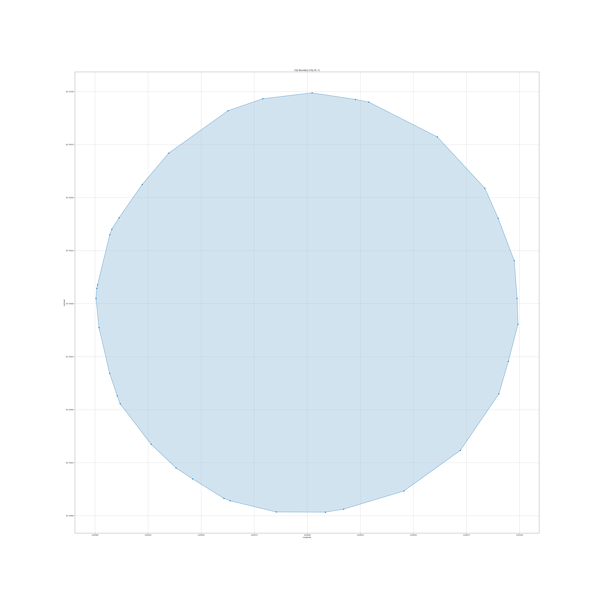
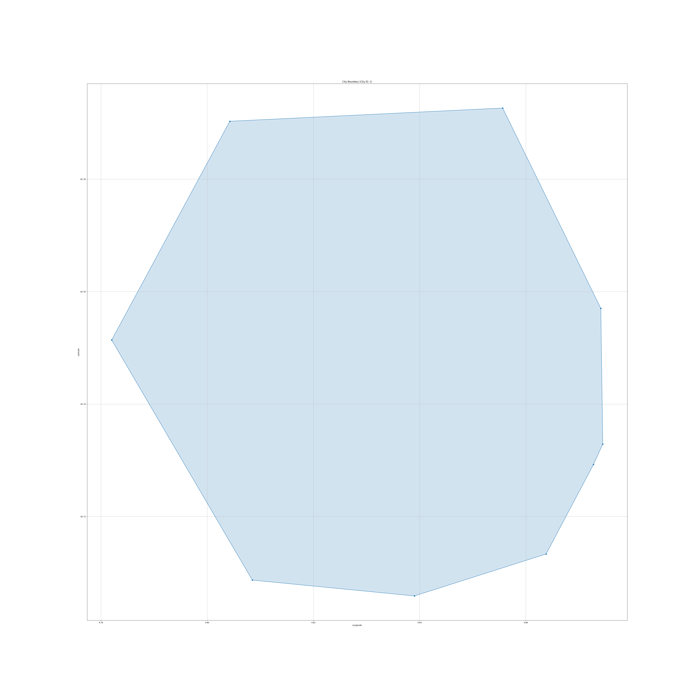

### Detailed Explanation of the Jarvis March Algorithm (Gift Wrapping Algorithm)

The Jarvis March algorithm, also known as the Gift Wrapping algorithm, is a well-known algorithm for finding the convex hull of a set of points. The convex hull is the smallest convex polygon that can enclose all given points. The Jarvis March algorithm works by "wrapping" the points in a manner similar to wrapping a gift, hence the name.

#### Outline of the Algorithm

1. **Find the leftmost point**: Start from the point with the smallest x-coordinate.
2. **Iteratively select the next point**: From the current point, select the point that is the most counterclockwise relative to all other points.
3. **Repeat until closure**: Continue this process until the algorithm returns to the starting point, forming a closed polygon.

#### Step-by-Step Description

1. **Initialization**:
   - Identify the leftmost point (let's call it `p0`).
   - Initialize the convex hull with this point.

2. **Main Loop**:
   - From the current point (`p`), examine all other points to find the one that is the most counterclockwise relative to `p`.
   - Add this point to the convex hull.
   - Update `p` to be this new point.

3. **Closure**:
   - Repeat the main loop until the algorithm returns to `p0`.

#### Mathematical Details

- **Orientation Test**:
  To determine if three points `p`, `q`, and `r` make a left turn (counterclockwise), a right turn (clockwise), or are collinear, we use the cross product of vectors `pq` and `qr`:
  \[
  \text{orientation}(p, q, r) = (q_y - p_y) \times (r_x - q_x) - (q_x - p_x) \times (r_y - q_y)
  \]
  - If the result is 0, points are collinear.
  - If the result is positive, points make a counterclockwise turn.
  - If the result is negative, points make a clockwise turn.

- **Selection of the Next Point**:
  For a given point `p`, the next point `q` is selected such that every other point `r` makes a counterclockwise turn relative to `p` and `q`.

#### Pseudocode

```text
function jarvis_march(points):
    n = len(points)
    if n < 3:
        return points

    hull = []

    # Find the leftmost point
    leftmost = points[0]
    for point in points:
        if point.x < leftmost.x:
            leftmost = point

    p = leftmost
    while True:
        hull.append(p)
        q = points[0]
        for r in points:
            if (q == p) or (orientation(p, q, r) == 2):
                q = r
        p = q
        if p == leftmost:
            break

    return hull

function orientation(p, q, r):
    val = (q.y - p.y) * (r.x - q.x) - (q.x - p.x) * (r.y - q.y)
    if val == 0:
        return 0 # collinear
    elif val > 0:
        return 1 # clockwise
    else:
        return 2 # counterclockwise
```

#### Detailed Example

Consider a set of points `P = {p1, p2, p3, ..., pn}`.

1. **Initialization**:
   - Find the leftmost point. Suppose `p1` is the leftmost point.
   - Initialize the convex hull with `p1`.

2. **First Iteration**:
   - From `p1`, find the point that is most counterclockwise relative to all other points. Let's say `p2` is this point.
   - Add `p2` to the convex hull.

3. **Second Iteration**:
   - From `p2`, find the next point that is most counterclockwise relative to all other points. Suppose this point is `p3`.
   - Add `p3` to the convex hull.

4. **Continuation**:
   - Repeat the process, adding points `p4, p5, ..., pk` to the convex hull.

5. **Closure**:
   - Eventually, the algorithm returns to `p1`, forming a closed polygon.

#### Complexity Analysis

- **Time Complexity**: O(nh), where `n` is the number of points and `h` is the number of points in the convex hull.
  - In the worst case, the time complexity can be O(n^2) when all points are on the convex hull.
- **Space Complexity**: O(h), where `h` is the number of points in the convex hull.

### Practical Implementation

Here's a more practical implementation in Python that demonstrates the algorithm using a set of random points.

```python
import random
import matplotlib.pyplot as plt

def jarvis_march(points):
    def orientation(p, q, r):
        return (q[1] - p[1]) * (r[0] - q[0]) - (q[0] - p[0]) * (r[1] - q[1])

    n = len(points)
    if n < 3:
        return points

    hull = []

    # Find the leftmost point
    leftmost = min(points, key=lambda p: p[0])
    p = leftmost
    while True:
        hull.append(p)
        q = points[0]
        for r in points:
            if (q == p) or (orientation(p, q, r) < 0):
                q = r
        p = q
        if p == leftmost:
            break

    return hull

# Generate random points
random.seed(0)
points = [(random.uniform(0, 1), random.uniform(0, 1)) for _ in range(100)]

# Compute the convex hull
hull = jarvis_march(points)

# Plot the points and the convex hull
plt.figure(figsize=(8, 8))
plt.scatter(*zip(*points), label='Points')
plt.plot(*zip(*hull, hull[0]), color='red', label='Convex Hull')
plt.legend()
plt.xlabel('X')
plt.ylabel('Y')
plt.title('Jarvis March Algorithm')
plt.show()
```

### Conclusion

The Jarvis March algorithm is a classic method for finding the convex hull of a set of points. Its straightforward approach makes it an excellent choice for understanding the fundamentals of computational geometry. By iteratively selecting the most counterclockwise point, the algorithm ensures the construction of the convex hull in a manner analogous to wrapping a gift, making it intuitive and easy to grasp.

### Improvement axes

### Areas for Improvement

While the Jarvis March algorithm effectively constructs the convex hull of a set of points, it has some limitations that may lead to undesired results, especially in practical applications such as simulating city boundaries. Here are some areas for improvement:

1. **Circular Shapes with Many Points**:
   - When the number of points is large, the resulting convex hull tends to approximate a circle. This occurs because the algorithm connects the outermost points, which naturally form a round shape if points are uniformly distributed.

*with 2500 points before modifications*


2. **Uneven Point Distribution**:
   - The points at the beginning and end of the convex hull are often more spaced out than those formed in the middle of the traversal. This uneven distribution can make the shape appear less natural and less representative of a realistic city boundary.

*with 17 points before modifications*


3. **More Randomized Shapes and Spacings**:
   - To create more realistic and varied shapes, the algorithm could be enhanced to produce more random and organic-looking boundaries. One approach is to introduce random perturbations to the points or define functions that trace curves between points without violating the convexity of the shape.

### Enhancing the Algorithm

To address these issues, several enhancements can be made to the algorithm:

1. **Random Perturbations**:
   - Introducing random perturbations to the points before applying the Jarvis March algorithm can help create more irregular and natural-looking boundaries. By slightly adjusting the position of each point, the resulting shape will be less circular and more varied.

2. **Non-Uniform Spacing**:
   - To ensure that points are not uniformly spaced, the algorithm can be modified to vary the distance between points. This can be achieved by adjusting the angle increment or by introducing random variations in the radial distances from the center.

3. **Curve Tracing Functions**:
   - To further enhance the natural appearance, functions that trace curves between points can be defined. These functions can generate curved segments between the points while maintaining the overall convexity of the shape. This approach adds complexity but can significantly improve the realism of the simulated city boundaries.

